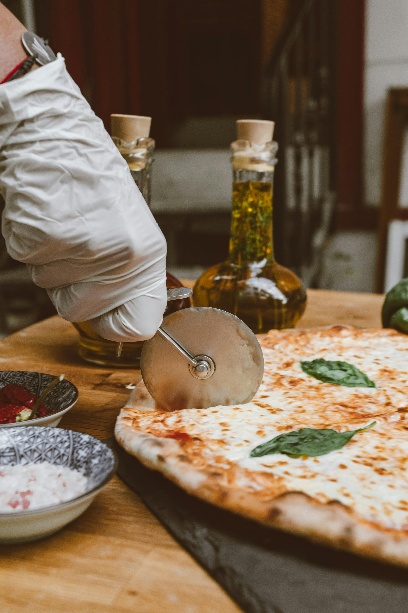
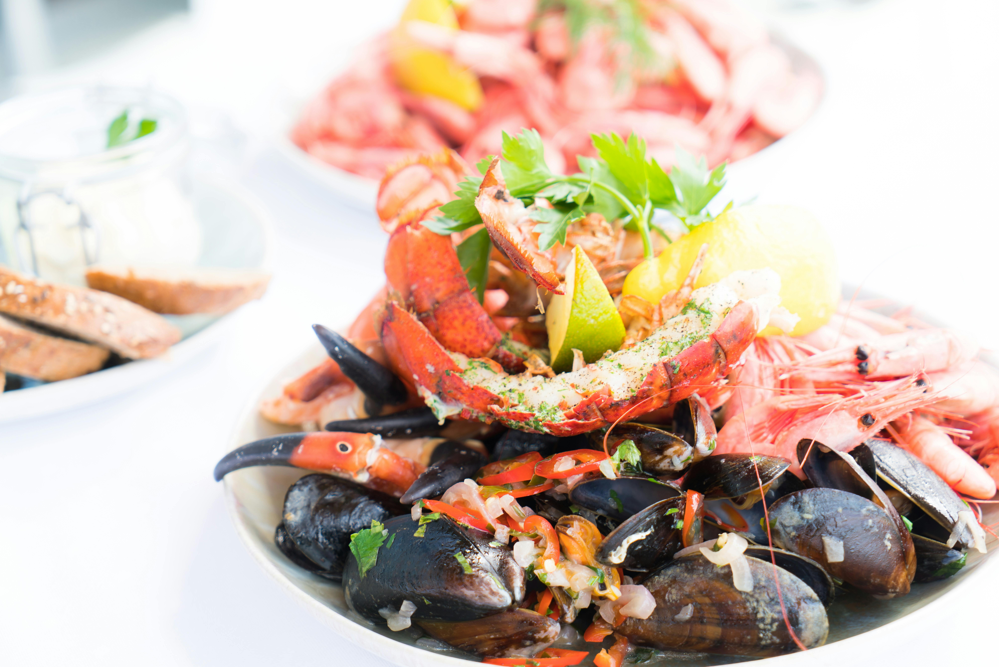
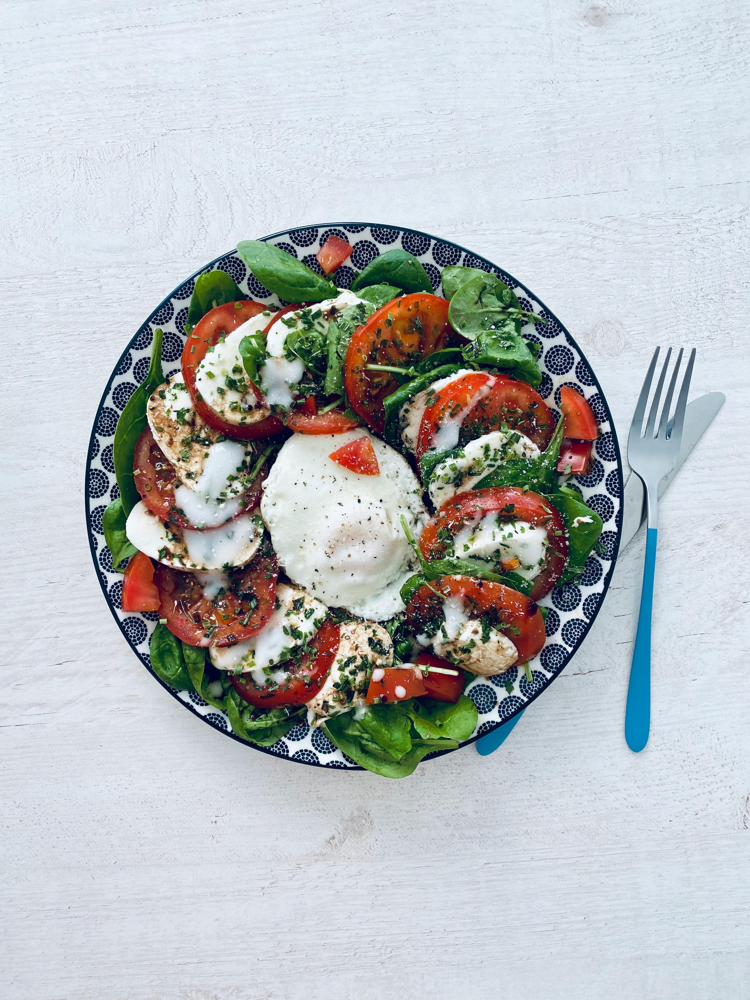
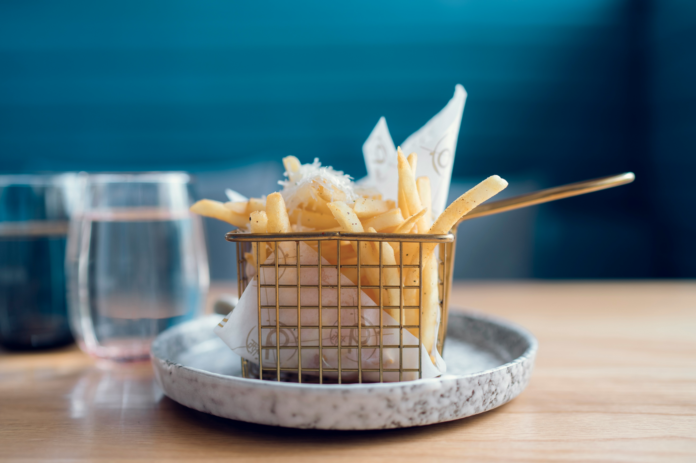

# Menu

## Pizze klasyczne

| Lp. | Pizza klasyczna | Cena: | Rozmiar: 30 cm | Rozmiar: 50 cm | Rozmiar: 60 cm |
| --- | ----------------- | ----- | -------------- | -------------- | -------------- |
| 1. | **Pizza Margherita** (Sos pomidorowy, mozzarella, świeże liście bazylii) |  | **€6.50** | **€9.50** | **€10.00** |
| 2. | **Pizza Marinara** (Sos pomidorowy, czosnek, oregano, oliwa z oliwek, świeże liście bazylii) |  | **€7.00** | **€10.00** | **€10.50** |
| 3. | **Pizza Pepperoni** (Sos pomidorowy, mozzarella, pikantna pepperoni, oregano) |  | **€8.00** | **€11.00** | **€11.50** |
| 4. | **Pizza Capricciosa** (Sos pomidorowy, mozzarella, pieczarki, szynka, karczochy, oliwki) |  | **€9.00** | **€12.00** | **€12.50** |
| 5. | **Pizza Quattro Stagioni** (Sos pomidorowy, mozzarella, szynka, pieczarki, karczochy, oliwki, szparagi) |  | **€9.50** | **€12.50** | **€13.00** |
| 6. | **Pizza Quattro Formaggi** (Sos pomidorowy, mozzarella, gorgonzola, parmezan, mozzarella di bufala) |  | **€10.00** | **€13.00** | **€13.50** |
| 7. | **Pizza Napoletana** (Sos pomidorowy, mozzarella, anchois, czarne oliwki, kapary, oregano) |  | **€8.50** | **€11.50** | **€12.00** |
| 8. | **Pizza Diavola** (Sos pomidorowy, mozzarella, pikantna pepperoni, papryczki chili, oregano) |  | **€8.50** | **€11.50** | **€12.00** |
| 9. | **Pizza Funghi e Prosciutto** (Sos pomidorowy, mozzarella, pieczarki, szynka, oregano) |  | **€9.00** | **€12.00** | **€12.50** |
| 10. | **Pizza Margherita con Bufala** (Sos pomidorowy, mozzarella di bufala, świeże liście bazylii) |  | **€10.50** | **€13.50** | **€14.00** |
| 11. | **Pizza Romana** (Sos pomidorowy, mozzarella, szynka, grzyby, cebula, jajko, oregano) |  | **€9.50** | **€12.50** | **€13.00** |
| 12. | **Pizza Siciliana** (Sos pomidorowy, mozzarella, oliwki, kapary, bakłażan, sardela, oregano) |  | **€9.00** | **€12.00** | **€12.50** |
| 13. | **Pizza Prosciutto e Rucola** (Sos pomidorowy, mozzarella, szynka parmeńska, rukola, płatki parmezanu, oliwa z oliwek) |  | **€10.50** | **€13.50** | **€14.00** |
| 14. | **Pizza Vegetariana** (Sos pomidorowy, mozzarella, papryka, cukinia, bakłażan, pomidory koktajlowe, czerwona cebula, oliwki, oregano) |  | **€10.00** | **€13.00** | **€13.50** |

## Pizza Calzone (zwinięta w pieróg)

| Lp. | Pizza Calzone | Cena: | Rozmiar: 30 cm | Rozmiar: 50 cm | Rozmiar: 60 cm |
| --- | ----------------- | ----- | -------------- | -------------- | -------------- |
| 1. | **Pizza Calzone Classico** (Sos pomidorowy, mozzarella, szynka, pieczarki, oregano) |  | **€10.00** | **€13.00** | **€14.50** |
| 2. | **Pizza Calzone Vegetariano** (Sos pomidorowy, mozzarella, papryka, cukinia, bakłażan, pomidory koktajlowe, czerwona cebula, oliwki, oregano) |  | **€11.00** | **€14.00** | **€15.50** |
| 3. | **Pizza Calzone Diavola** (Sos pomidorowy, mozzarella, pikantna pepperoni, papryczki chili, oregano) |  | **€10.50** | **€13.50** | **€15.00** |
| 4. | **Pizza Calzone Capricciosa** (Sos pomidorowy, mozzarella, pieczarki, szynka, karczochy, oliwki) |  | **€11.50** | **€14.50** | **€16.00** |
| 5. | **Pizza Calzone Quattro Formaggi** (Sos pomidorowy, mozzarella, gorgonzola, parmezan, mozzarella di bufala) |  | **€12.00** | **€15.00** | **€16.50** |
| 6. | **Pizza Calzone Napoletana** (Sos pomidorowy, mozzarella, anchois, czarne oliwki, kapary, oregano) |  | **€11.00** | **€14.00** | **€15.50** |
| 7. | **Pizza Calzone Funghi e Prosciutto** (Sos pomidorowy, mozzarella, pieczarki, szynka, oregano) |  | **€11.50** | **€14.50** | **€16.00** |
| 8. | **Pizza Calzone Margherita** (Sos pomidorowy, mozzarella, świeże liście bazylii) |  | **€9.50** | **€12.50** | **€14.00** |
| 9. | **Pizza Calzone Romana** (Sos pomidorowy, mozzarella, szynka, grzyby, cebula, jajko, oregano) |  | **€12.00** | **€15.00** | **€16.50** |
| 10. | **Pizza Calzone Siciliana** (Sos pomidorowy, mozzarella, oliwki, kapary, bakłażan, sardela, oregano) |  | **€11.50** | **€14.50** | **€16.00** |
| 11. | **Pizza Calzone Prosciutto e Rucola** (Sos pomidorowy, mozzarella, szynka parmeńska, rukola, płatki parmezanu, oliwa z oliwek) |  | **€12.50** | **€15.50** | **€17.00** |
| 12. | **Pizza Calzone Margherita con Bufala** (Sos pomidorowy, mozzarella di bufala, świeże liście bazylii) |  | **€13.00** | **€16.00** | **€17.50** |
| 13. | **Pizza Calzone Pepperoni** (Sos pomidorowy, mozzarella, pikantna pepperoni, oregano) |  | **€10.50** | **€13.50** | **€15.00** |
| 14. | **Pizza Calzone Quattro Stagioni** (Sos pomidorowy, mozzarella, szynka, pieczarki, karczochy, oliwki, szparagi) |  | **€12.50** | **€15.50** | **€17.00** |

## Pizza wegetariańska

| Lp. | Pizza Wegetariańska | Cena: | Rozmiar: 30 cm | Rozmiar: 50 cm | Rozmiar: 60 cm |
| --- | -------------------- | ----- | -------------- | -------------- | -------------- |
| 1.  | **Pizza Vegetariana** (Sos pomidorowy, mozzarella, pieczarki, cebula, papryka, oliwki, pomidory koktajlowe, oregano) |  | **€9.00** | **€12.00** | **€13.50** |
| 2.  | **Pizza Primavera** (Sos pomidorowy, mozzarella, cukinia, bakłażan, pomidory koktajlowe, szparagi, czerwona cebula, oregano) |  | **€10.00** | **€13.00** | **€14.50** |
| 3.  | **Pizza Spinaci e Funghi** (Sos pomidorowy, mozzarella, szpinak, pieczarki, czerwona cebula, czosnek, oliwki, oregano) |  | **€10.50** | **€13.50** | **€15.00** |
| 4.  | **Pizza Margherita Vegetariana** (Sos pomidorowy, mozzarella, świeże liście bazylii, pomidory koktajlowe, rukola, oliwki, oregano) |  | **€11.00** | **€14.00** | **€15.50** |
| 5.  | **Pizza Bianca z Warzywami** (Sos śmietanowy, mozzarella, cukinia, pieczarki, papryka, cebula, suszone pomidory, oregano) |  | **€11.50** | **€14.50** | **€16.00** |
| 6.  | **Pizza Verdura** (Sos pomidorowy, mozzarella, cukinia, bakłażan, szparagi, pomidory suszone, czosnek, oliwki, oregano) |  | **€12.00** | **€15.00** | **€16.50** |
| 7.  | **Pizza Pomodoro e Basilico** (Sos pomidorowy, mozzarella, pomidory suszone, świeże liście bazylii, czosnek, oliwki, oregano) |  | **€10.50** | **€13.50** | **€15.00** |
| 8.  | **Pizza Funghi e Olive** (Sos pomidorowy, mozzarella, pieczarki, oliwki, czerwona cebula, czosnek, oregano) |  | **€11.00** | **€14.00** | **€15.50** |
| 9.  | **Pizza Ortolana** (Sos pomidorowy, mozzarella, cukinia, bakłażan, pieczarki, papryka, cebula, oliwki, oregano) |  | **€11.50** | **€14.50** | **€16.00** |
| 10. | **Pizza Margherita z Grillowanymi Warzywami** (Sos pomidorowy, mozzarella, grillowane cukinia, papryka, bakłażan, cebula, pomidory koktajlowe, oregano) |  | **€12.00** | **€15.00** | **€16.50** |

## Makarony

| Lp. | Makaron | Cena: | Rozmiar: 500 g | Rozmiar: 650 g |
| --- | ------------------- | ----- | -------------- | -------------- |
| 1. | **Spaghetti Bolognese** (Sos boloński z mięsem mielonym, pomidory, cebula, czosnek, przyprawy) | | **€8.00** | **€10.00** |
| 2. | **Penne Arrabiata** (Sos pomidorowy z dodatkiem papryczek chili, czosnku, oliwy z oliwek) | | **€7.50** | **€9.50** |
| 3. | **Lasagne al Forno** (Płaty makaronu, sos boloński, beszamel, ser) | | **€9.50** | **€11.50** |
| 4. | **Tagliatelle Carbonara** (Makaron tagliatelle, sos carbonara z boczkiem, jajka, ser parmezan) | | **€8.50** | **€10.50** |
| 5. | **Fettuccine Alfredo** (Makaron fettuccine, sos śmietanowy z masłem i serem parmezan) | | **€8.00** | **€10.00** |
| 6. | **Ravioli Ripieni di Ricotta e Spinaci** (Ravioli nadziewane ricottą i szpinakiem, podawane z sosem pomidorowym) | | **€9.00** | **€11.00** |
| 7. | **Tortellini alla Panna** (Tortellini nadziewane mięsem, sos śmietanowy) | | **€8.50** | **€10.50** |
| 8. | **Gnocchi Sorrentina** (Kluski gnocchi, sos pomidorowy, mozzarella, bazylia) | | **€8.00** | **€10.00** |
| 9. | **Farfalle Primavera** (Makaron farfalle, warzywa sezonowe, sos śmietanowy) | | **€8.50** | **€10.50** |
| 10. | **Cannelloni Ricotta e Spinaci** (Roladki makaronowe nadziewane ricottą i szpinakiem, sos boloński) | | **€9.00** | **€11.00** |
| 11. | **Tortellini al Forno** (Tortellini nadziewane mięsem, sos pomidorowy, beszamel, ser) | | **€9.50** | **€11.50** |
| 12. | **Pappardelle ai Funghi** (Szerokie wstążki makaronu, sos śmietanowy z grzybami) | | **€8.50** | **€10.50** |
| 13. | **Linguine alle Vongole** (Makaron linguine z małżami, czosnek, pietruszka, oliwa z oliwek) | | **€9.50** | **€11.50** |
| 14. | **Rigatoni alla Norma** (Makaron rigatoni, sos pomidorowy, bakłażan, bazylia, ser ricotta) | | **€8.50** | **€10.50** |

## Dania z owocami morza 

| Lp. | Danie z owocami morza | Cena: | Rozmiar: 500 g | Rozmiar: 650 g |
| --- | ----------------- | ----- | -------------- | -------------- |
| 1. | **Calamari alla Griglia** (Kalmary grillowane z cytryną, czosnkiem, pietruszką, oliwą z oliwek) | | **€13.00** | **€15.00** |
| 2. | **Zuppa di Pesce** (Zupa z owocami morza, rybami, warzywami, pomidorami, przyprawami) | | **€14.00** | **€16.00** |
| 3. | **Scampi alla Griglia** (Krewetki grillowane z czosnkiem, cytryną, pietruszką, oliwą z oliwek) | | **€15.00** | **€17.00** |
| 4. | **Gamberi all'Aglio** (Krewetki duszone z czosnkiem, czerwoną papryką, białym winem, pietruszką) | | **€13.50** | **€15.50** |
| 5. | **Frittura di Pesce** (Smażone dania z owocami morza: kalmary, krewetki, ryby) | | **€14.50** | **€16.50** |
| 6. | **Cozze alla Marinara** (Małże w sosie pomidorowym z czosnkiem, cebulą, białym winem, pietruszką) | | **€11.00** | **€13.00** |
| 7. | **Sogliola al Limone** (Sole smażona z cytryną, czosnkiem, pietruszką, masłem) | | **€16.00** | **€18.00** |

## Sałatki

| Lp. | Sałatka | Cena: |
| --- | ------------------- | ----- |
| 1. | **Caprese** (Pomidory, mozzarella, bazylika, oliwa z oliwek, sól, pieprz) | **€8.50** |
| 2. | **Insalata di Rucola e Parmigiano** (Rukola, płatki parmezanu, oliwa z oliwek, cytryna) | **€9.00** |
| 3. | **Insalata Mista** (Mieszanka sałat, pomidory, ogórki, czerwona cebula, oliwa z oliwek, ocet balsamiczny) | **€7.50** |
| 4. | **Insalata di Mare** (Sałata, owoce morza, pomidory, czerwona cebula, oliwa z oliwek, cytryna) | **€12.00** |
| 5. | **Panzanella** (Chleb tostowy, pomidory, ogórki, czerwona cebula, bazylia, oliwa z oliwek, ocet winny, sól, pieprz) | **€10.00** |
| 6. | **Insalata di Pollo** (Sałata, grillowany kurczak, pomidory, ogórki, papryka, czerwona cebula, oliwa z oliwek, ocet winny) | **€11.50** |
| 7. | **Carpaccio di Manzo** (Plastry wołowiny, rukola, płatki parmezanu, oliwa z oliwek, sok z cytryny, kapary) | **€13.50** |

## Dodatki

1. Cukinia - **€2.50** 
2. Karczochy - **€3.00** 
3. Krewetki - **€4.50**
4. French fries - **€2.50**

## Napoje i wina

| Lp. | Napój | Kategoria | Cena: | Rozmiar: standardowy | Rozmiar: 330 ml | Rozmiar: 500 ml | Cena za lampkę | Cena za butelkę |
| --- | ----------------- | --------- | ----- | ------------------- | -------------- | -------------- | -------------- | --------------- |
| 1. | **Espresso** (Tradycyjna włoska kawa espresso) | Napój | | **€2.50** | | | |
| 2. | **Cappuccino** (Kawa espresso z mlekiem i mleczną pianką) | Napój | | **€3.00** | | | |
| 3. | **Caffè Latte** (Kawa espresso z gorącym mlekiem i minimalną ilością pianki) | Napój | | **€3.50** | | | |
| 4. | **Limoncello** (Tradycyjny włoski likier cytrynowy) | Napój alkoholowy | | **€5.00** |  | |  | |
| 5. | **Aperol Spritz** (Klasyczny włoski aperitif na bazie Aperolu, prosecco i wody sodowej) | Napój alkoholowy | | | **€4.50** | **€7.50** | | |
| 6. | **Negroni** (Klasyczny włoski koktajl z ginu, wermutu i Campari) | Napój alkoholowy | | | **€5.50** | **€8.50** | | |
| 7. | **Prosecco** (Włoskie białe wino musujące) | Wino musujące | | | | | **€10.00** | **€25.00** |
| 8. | **Lambrusco** (Włoskie czerwone wino musujące) | Wino musujące | | | | | **€8.00** | **€20.00** |
| 9. | **Pinot Grigio** (Włoskie białe wino) | Wino białe | | | | | **€10.00** | **€25.00** |
| 10. | **Vermentino** (Włoskie białe wino z regionu Ligurii) | Wino białe | | | | | **€12.00** | **€28.00** |
| 11. | **Soave** (Włoskie białe wino z regionu Wenecji) | Wino białe | | | | | **€9.00** | **€22.00** |
| 12. | **Chardonnay** (Włoskie białe wino z odmiany Chardonnay) | Wino białe | | | | | **€12.00** | **€30.00** |
| 13. | **Chianti** (Czerwone wino z Toskanii) | Wino czerwone | | | | | **€12.00** | **€30.00** |
| 14. | **Barolo** (Czerwone wino z regionu Piemont) | Wino czerwone | | | | | **€15.00** | **€40.00** |
| 15. | **Montepulciano d'Abruzzo** (Czerwone wino z regionu Abruzji) | Wino czerwone | | | | | **€8.00** | **€18.00** |
| 16. | **Brunello di Montalcino** (Czerwone wino z regionu Toskanii) | Wino czerwone | | | | | **€20.00** | **€50.00** |
| 17. | **Sangiovese** (Włoskie czerwone wino z odmiany Sangiovese) | Wino czerwone | | | | | **€15.00** | **€35.00** |
| 18. | **Rosato** (Włoskie różowe wino) | Wino różowe | | | | | **€15.00** | **€35.00** |

