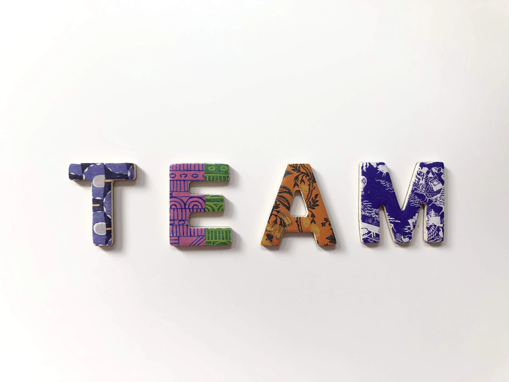
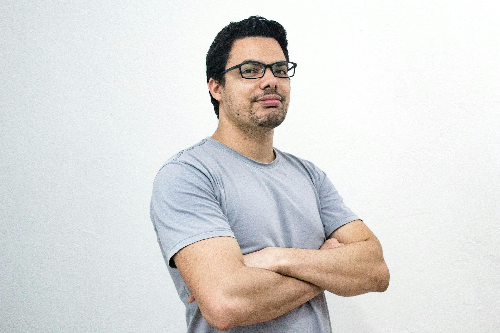
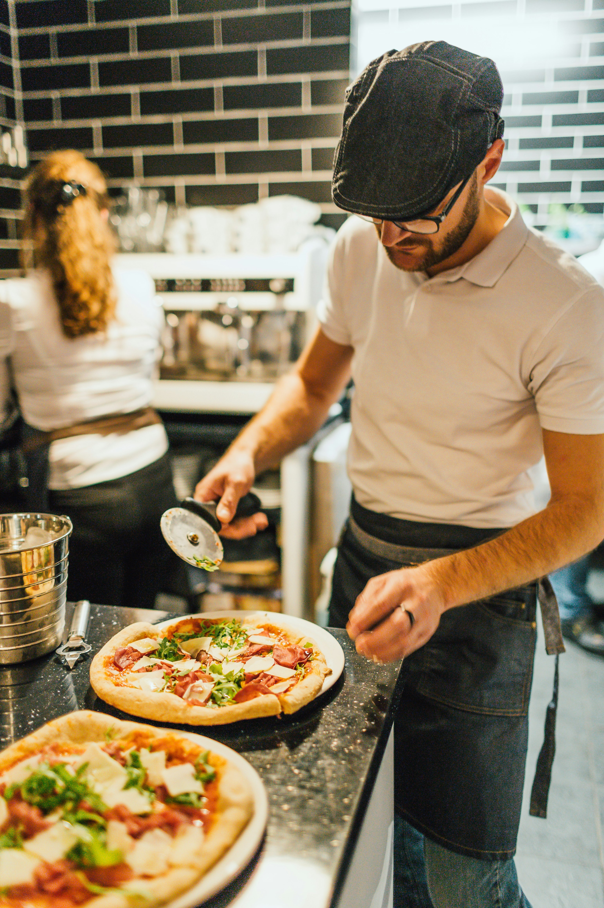
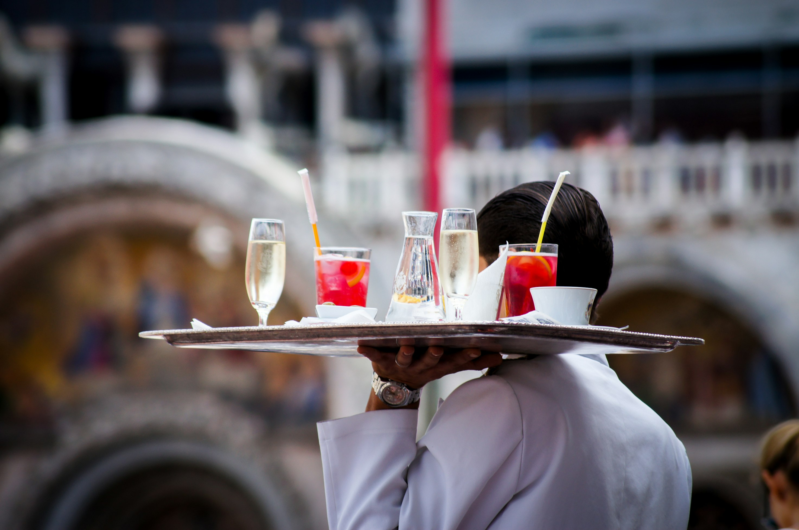
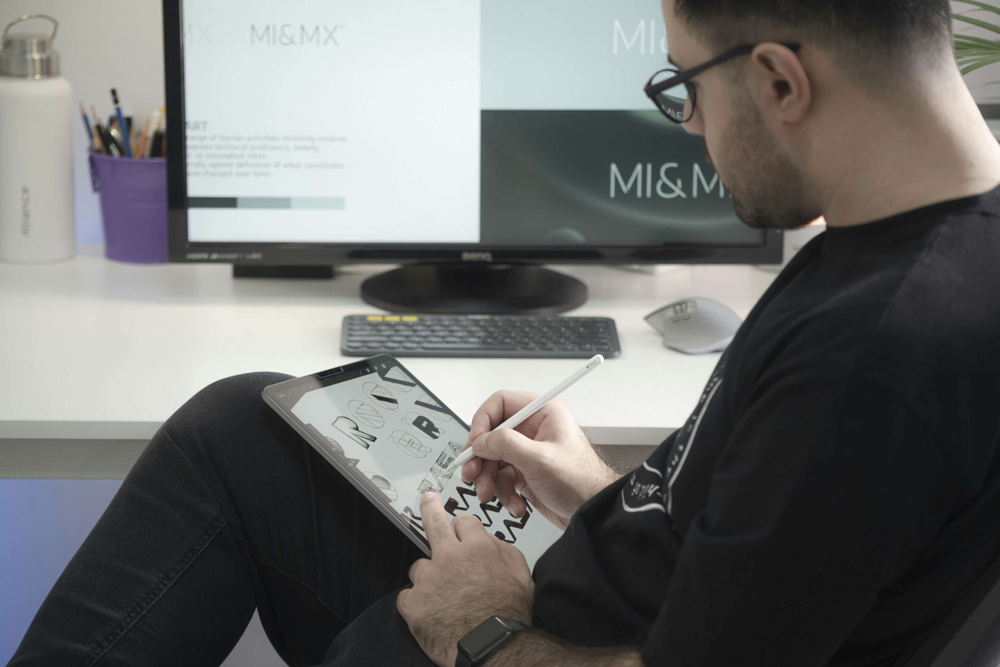

# Zespół

W **Pizzerii a Strongoli** w Marina di Strongoli, zespół stanowi serce i dusza tego popularnego lokalu. 
Nasz zespół składa się z pasjonatów kuchni włoskiej, którzy łączą tradycję z nowoczesnością, aby dostarczyć naszym gościom niezapomniane doznania kulinarne.

## Kierownik

Giovanni Rossi.

## Kucharz

 Sofia Esposito, Maria Leone, Giuseppe Ricci, Luca Romano.

## Obsługa

Camilla Monti, Francesca Conti, Elena Greco, Federico Gallo, Giorgio Rinaldi.

## Dostawca

Valentina Pugliese, Martina Sartori, Alessia Vitale, Vincenzo Costa.

## Grafik

Alessandro Moretti.

