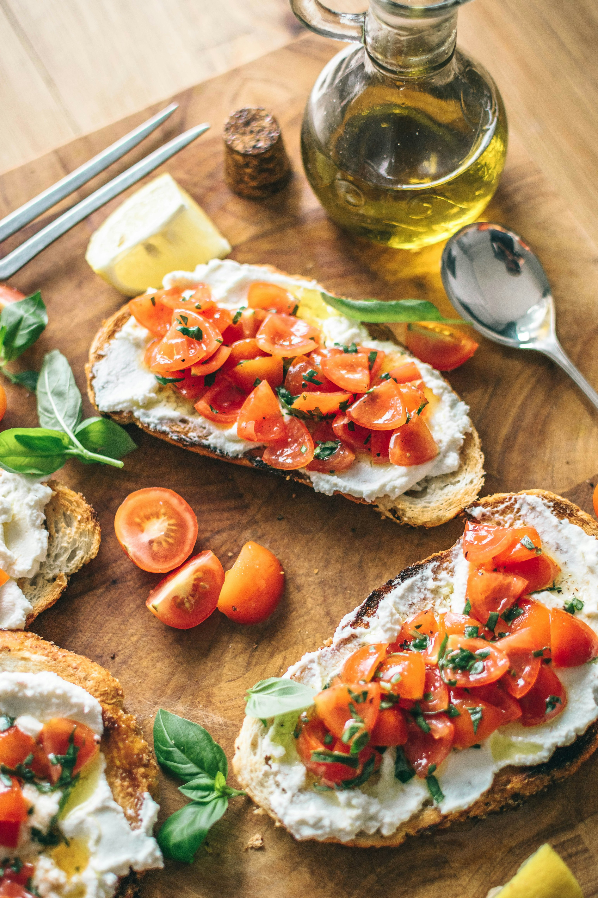
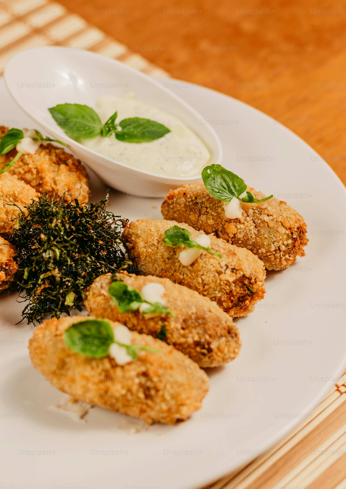
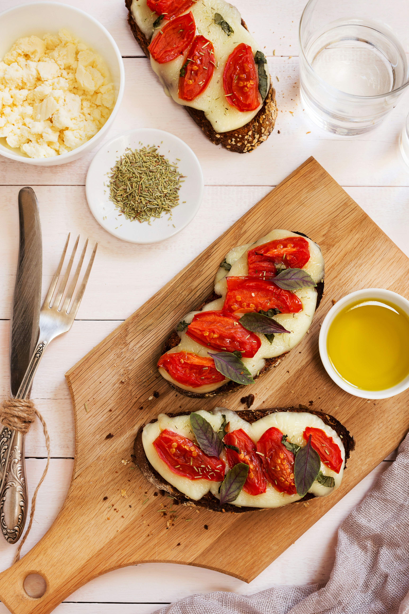

# Przepisy

**Pizzeria a Strongoli** z przyjemnością dzieli się swoimi przepisami z obcokrajowcami, którzy mieli przyjemność być jej gośćmi. Teraz każdy, kto odwiedził naszą restaurację, może odtworzyć ulubione potrawy we własnym domu, ciesząc się smakiem **Marina di Strongoli**, niezależnie od tego, gdzie się znajduje. Zapraszamy do kulinarnej podróży i odkrywania włoskiej kuchni w najlepszym wydaniu!

## Bruschetta z pomidorami i bazylią

**Składniki**:

4 kromki chleba ciabatta

4 dojrzałe pomidory

2 ząbki czosnku

Garść świeżej bazylii

4 łyżki oliwy z oliwek extra virgin

Sól i pieprz do smaku

Ocet balsamiczny (opcjonalnie)

**Sposób przygotowania**:

**Przygotowanie chleba**:

Rozgrzej piekarnik do 200°C (lub rozgrzej patelnię grillową).
Ułóż kromki ciabatty na blasze do pieczenia i piecz przez około 5-7 minut, aż staną się złociste i chrupiące. Można także opiec je na patelni grillowej, aż będą chrupiące z obu stron.

**Przygotowanie pomidorów**:

Pomidory sparz wrzątkiem, obierz ze skórki i pokrój w drobną kostkę.
Przełóż pokrojone pomidory do miski.

**Przygotowanie mieszanki**:

Dodaj do pomidorów posiekany czosnek oraz porwane na kawałki liście bazylii.
Dodaj oliwę z oliwek, sól i pieprz do smaku. Dokładnie wymieszaj.

**Serwowanie**:

Na każdą kromkę chleba nałóż mieszankę pomidorową.
Skrop lekko octem balsamicznym, jeśli lubisz.
Podawaj natychmiast, aby chleb pozostał chrupiący.

## Caprese

**Składniki**:

3 duże, dojrzałe pomidory

250g świeżej mozzarelli

Garść świeżej bazylii

4 łyżki oliwy z oliwek extra virgin

Sól morska i świeżo zmielony pieprz do smaku

Ocet balsamiczny (opcjonalnie)

**Sposób przygotowania**:

**Przygotowanie składników**:

Pomidory umyj i pokrój w plasterki o grubości około 1 cm.
Mozzarellę pokrój w plasterki o podobnej grubości.

**Układanie na talerzu**:

Na dużym talerzu układaj na przemian plasterki pomidora i mozzarelli, tak aby lekko nachodziły na siebie.
Rozłóż liście bazylii między plasterkami pomidora i mozzarelli.

**Doprawianie**:

Skrop oliwą z oliwek, posól i popieprz do smaku.
Opcjonalnie skrop lekką ilością octu balsamicznego dla dodatkowego smaku.

**Serwowanie**:

Podawaj od razu, najlepiej w temperaturze pokojowej, aby smaki były pełniejsze.
Te proste, ale niezwykle smaczne przystawki doskonale oddają smak i aromat włoskiej kuchni, a ich przygotowanie nie zajmie Ci wiele czasu. Smacznego!

## Arancini (Włoskie kuleczki ryżowe)

**Składniki**:

300g ryżu do risotto (np. Arborio)

1 litr bulionu warzywnego

1 mała cebula, drobno posiekana

2 ząbki czosnku, drobno posiekane

100ml białego wina (opcjonalnie)

50g startego parmezanu

2 jajka

100g mozzarelli, pokrojonej w małe kostki

Mąka do obtoczenia

Bułka tarta do obtoczenia

Oliwa z oliwek do smażenia

Sól i pieprz do smaku

**Sposób przygotowania**:

**Przygotowanie risotto**:

Podgrzej oliwę w dużym rondlu, dodaj cebulę i czosnek, smaż aż zmiękną.
Dodaj ryż i smaż przez 2-3 minuty, aż stanie się przezroczysty.
Dodaj wino, jeśli używasz, i mieszaj, aż całkowicie wyparuje.
Stopniowo dodawaj gorący bulion, po jednej chochli, mieszając, aż ryż wchłonie płyn. Kontynuuj, aż ryż będzie miękki, ale al dente.
Dodaj starty parmezan, dopraw solą i pieprzem do smaku. Odstaw do ostygnięcia.

**Formowanie arancini**:

Gdy risotto ostygnie, dodaj jedno jajko i dobrze wymieszaj.
Weź łyżkę mieszanki ryżowej, w środku umieść kostkę mozzarelli i uformuj kulkę. Powtórz z resztą ryżu.

**Panierowanie i smażenie**:

Rozgrzej olej w głębokiej patelni lub frytkownicy do 180°C.
Kulki obtocz w mące, następnie w roztrzepanym jajku, a na końcu w bułce tartej.
Smaż arancini na złoty kolor, około 3-4 minuty.
Odsącz na papierze kuchennym. Podawaj na ciepło z ulubionym sosem.

## Crostini z pastą z oliwek i suszonych pomidorów

**Składniki**:

1 bagietka

1 szklanka czarnych oliwek bez pestek

½ szklanki suszonych pomidorów w oleju

2 ząbki czosnku

2 łyżki kaparów

4 łyżki oliwy z oliwek extra virgin

Świeże zioła (np. bazylia, oregano) do dekoracji

Sól i pieprz do smaku

**Sposób przygotowania**:

**Przygotowanie crostini**:

Pokrój bagietkę na cienkie kromki i opiecz w piekarniku rozgrzanym do 200°C przez około 5-7 minut, aż będą złociste i chrupiące. Można również opiec je na patelni grillowej.

**Przygotowanie pasty z oliwek i pomidorów**:

W blenderze umieść oliwki, suszone pomidory, czosnek, kapary i oliwę z oliwek. Miksuj, aż uzyskasz gładką pastę.
Dopraw solą i pieprzem do smaku. Jeśli pasta jest zbyt gęsta, dodaj więcej oliwy z oliwek.

**Serwowanie**:

Na każdą kromkę bagietki nałóż pastę z oliwek i suszonych pomidorów.
Udekoruj świeżymi ziołami.
Podawaj od razu jako pyszną przekąskę lub przystawkę.
